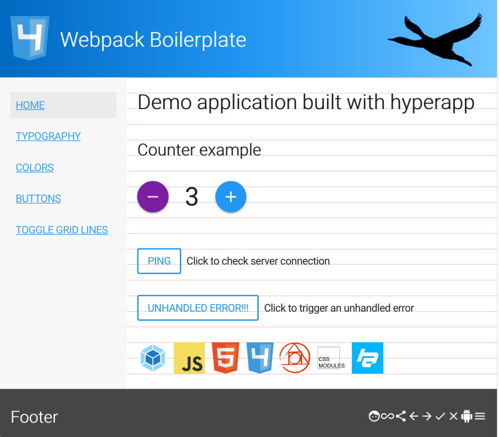

# Webpack boilerplate



## Features
* ES2015/ES2016/ES2017
* Npm as a task/build runner
* [Webpack](https://webpack.js.org/) with tree-shaking and hot module replacement (HMR)
* Webpack [DLL plugin](https://github.com/webpack/docs/wiki/list-of-plugins#dllplugin) for [faster builds](https://robertknight.github.io/posts/webpack-dll-plugins/)
* Load polyfills on demand using [dynamic import](https://webpack.js.org/guides/code-splitting-import/#dynamic-import)
* Lazy loading (System.import) of (large) libraries that is not needed at application startup
* Node Express middleware
* Linting with eslint and stylelint
* Unit tests with Mocha, Chai, Sinon and JSDom
* Integration tests with Node Express server 
* Acceptance testing with WebdriverIO, Cucumber.js, and Node Express
* Code coverage and reporting with Istanbul
* PostCSS/css-next/CSS Modules
* Self hosting Google Material Icons and Font Roboto
* CSS reset using [normalize.css](https://github.com/necolas/normalize.css)
* Example application built with [HyperApp](https://hyperapp.js.org/)
* [Responsive Font Size And Fluid Typography With vh And vw Units](https://www.smashingmagazine.com/2016/05/fluid-typography/)
* Framework agnostic. No dependencies to frameworks like React or Angular
* Uses [husky](https://github.com/typicode/husky) to prevent bad commits

## Get Started
* Install [Node7, Node8 or Node9](https://nodejs.org/en/), preferably using [nvm](https://github.com/creationix/nvm)
* Optionally install [Yarn](https://yarnpkg.com/en/)
* CD to your dev directory, e.g. `cd ~/dev`
* Clone this repository: `git clone https://github.com/leifoolsen/webpack2-boilerplate.git` (or download zip)
* CD to project root: `cd webpack2-boilerplate`
* Install dependencies: `yarn install` or `npm install` 
* Build dll: `npm run build:dll`
* Start dev server: `npm start`
* Open a browser at `http://localhost:8084`

## Start coding
* Modify `package.json`, e.g. `name, author, description, repository` 
* Rename project directory to reflect package name
* Add your own 3'rd party dependencies
* Add those 3'rd party dependencies to `./src/vendor.js`, or use System.import() to import 3'rd party dependencies on demand
* Every time you add or update third party dependenecies, remember to build dll: `npm run build:dll`

>**Note:** Also remember to add your own repo to package.json 
```
  "repository": {
    "type": "git",
    "url": "https://github.com/<your-git>/<your-project>.git"
  },
```

* Wipe commit history
```bash
rm -rf .git
git init
git add .
git commit -m "initial commit"
```
* Add your remote: `git remote add origin <ssh_or_https_url>`
* Open a console (shell) and type: `npm start`
* Open a browser at `http://localhost:8084`
* Start coding

#### Verify that CSS HMR works

* Modify some CSS code, e.g. in `./src/app/styles/base/color.css`, modify the `background-color` property

```css
.primary {
  @mixin primary;
}
```

* Change background color to e.g. `red` and save

```css
.primary {
  @mixin primary;
  background-color: red;
}
```

* Switch to your browser and click the `Colors` menu
* The box with the primary color should be red
* Delete the `background-color` property and switch back to the browser again
* The box with the primary color should have the initial color
 
#### Verify that JS HMR works

* Switch to your browser and click the `Home` menu
* Click the `Ping` button and verify that the response is displayed with a date, e.g.<br/>`2018-01-05 17:44:24: {"status":200, ..."}` 
* Modify `./src/app/actions/pingServer.js`

```javascript
import request from '../../utils/request';

async function determineTime() {
  const moment = await import('moment');
  return moment().format('YYYY-MM-DD HH:mm:ss');
}
const pingServer = (url) => {
  return request(url)
    .then(response => {
      return determineTime()
        .then(time => {
          return `${time}: ${JSON.stringify(response)}`;
        });
    })
    .catch(err => err);
};
export default pingServer;
```

* Remove date, `YYYY-MM-DD`, from format and save

```javascript
async function determineTime() {
  const moment = await import('moment');
  return moment().format('HH:mm:ss');
}
```
* Switch to browser and click the `Ping` button again
* The response should be displayed without a date, e.g.<br/>`17:47:24: {"status":200, ..."}`  

### Try the bundle
The bundled code is minified and optimized code ready for deployment to your 
preferred webserver. Before deployment you can verify that the code behaves as 
expected by running the following npm commands.      

* `npm run build:prod`
* `npm run server`
* Open a browser at `http://localhost:8000`

### Webpack DLL plugin
The Dll Plugin lets you pre-build the parts of your code that don't often change (such as third party library code).
Add code that should be built by the Dll plugin to `vendor.js`. Code built by the the Dll plugin
does not utilize tree shaking and is therefore only used for development. For a production build,
the same `vendor.js` file is added as a entry in your webpack project for minification and elimination of dead code.

* See: [OPTIMIZING WEBPACK FOR FASTER REACT BUILDS](http://engineering.invisionapp.com/post/optimizing-webpack/)
* See: [Optimizing Webpack build times and improving caching with DLL bundles](https://robertknight.github.io/posts/webpack-dll-plugins/)
* See: [Webpack Plugins we been keepin on the DLL](https://medium.com/@soederpop/webpack-plugins-been-we-been-keepin-on-the-dll-cdfdd6cb8cd7)

### Lazy loading, System.import()
If you have (large) libraries that is not needed at application startup, you can use
lazy loading. Lazy loading (System.import()) is demonstrated in code above.

* See: [Webpack: Code Splitting - Async](https://webpack.js.org/guides/code-splitting-async/)
* See: [Lazy Loading](https://webpack.js.org/guides/lazy-loading/)

### Polyfills
Add your polyfills to `polyfill.js`
* See: [Webpack: Code Splitting - Async](https://webpack.js.org/guides/code-splitting-async/)
* See: [WE DON'T NEED YOUR POLYFILLS!](http://anzorb.com/we-dont-need-your-polyfills/)
* See: [Polyfills: everything you ever wanted to know, or maybe a bit less](https://hackernoon.com/polyfills-everything-you-ever-wanted-to-know-or-maybe-a-bit-less-7c8de164e423)
* See: [Conditionally load multiple Polyfills using Webpack, Promises and Code Splitting](http://anujnair.com/blog/13-conditionally-load-multiple-polyfills-using-webpack-promises-and-code-splitting)

## Running tests
Tests are divided into three categories; unit tests, integration tests and 
acceptance tests. Unit tests and integration tests uses Moca as a test runner. 
The acceptance tests uses WebdriverIO as a test runner. Istanbul is used
for code coverage and reporting. 

### Unit tests
The following libraries are used:
* Mocha
* Chai
* Sinon
* JsDom headless browser
* Istanbul

To run the unit tests type: `npm run test:unit`

### Integration tests
The following libraries are used:
* Mocha
* Chai
* Supertest
* ExpressJS
* Istanbul
 
To run the ingtegration tests type: `npm run test:it`
 
### Acceptance tests
The following libraries are used:
* WebdriverIO
* WDIO Selenium standalone service
* Selenium standalone
* Cucumber
* Chai
* ExpressJS

For now, the (standalone) acceptance tests must be run manually. The only way to 
ro run standalone acceptance tests on a CI server, is to use a headless browser 
like PhantomJS (I think). Unfortunatley I have so far had no success running 
acceptance tests using PhantomJS.

#### Required steps to run acceptance tests
```bash
# yarn, or npm install - just in case
yarn install / npm install

# Make bundle
npm run build:prod

# Fetch actual Seleninum distro
NODE_TLS_REJECT_UNAUTHORIZED=0 ./node_modules/.bin/selenium-standalone install

# Run acceptance tests
npm run wdio

# Expected output

------------------------------------------------------------------
[chrome #0-0] Session ID: e0bf7b24-2bfa-4053-ad47-1e87d5fe409a
[chrome #0-0] Spec: ~/dev/webpack2-boilerplate/test/features/example.feature
[chrome #0-0] Running: chrome
[chrome #0-0]
[chrome #0-0] Title check
[chrome #0-0]
[chrome #0-0]     Get the title of webpage
[chrome #0-0]       ✓ I open the url "http://localhost:8082/"
[chrome #0-0]       ✓ I expect the title of the page to be "Webpack2 Boilerplate"
[chrome #0-0]
[chrome #0-0]     Click the Ping button
[chrome #0-0]       ✓ I open the url "http://localhost:8082/"
[chrome #0-0]       ✓ I click the Ping button
[chrome #0-0]       ✓ I expect the response to be "pong!"
[chrome #0-0]
[chrome #0-0]
[chrome #0-0] 5 passing (5s)

```

>**Chromedriver**<br/>
>According to the [WebdriverIO Get Stared guide](http://webdriver.io/guide/getstarted/install.html),
>the [Chromedriver standalone server](https://sites.google.com/a/chromium.org/chromedriver/home)
>is required for running Chrome browser tests on a local machine. On 
>latest Ubuntu and OSX I have run the tests **without installing the Chromedriver**. 
>So far I have not experienced any problems running the tests without 
>the Chrome Driver. If you must install Chromedriver, instructions can be found
>e.g. [here](https://sites.google.com/a/chromium.org/chromedriver/home), 
>[here](https://fossies.org/linux/electron/docs/tutorial/using-selenium-and-webdriver.md)
>and [here](https://github.com/Matt-B/cucumber-js-selenium-webdriver-example). 

### Test coverage
`npm run build:prod`, then browse `./coverage/lcov-report/index.html`, 
`./coverage/unit/lcov-report/index.html`, `./coverage/integration/lcov-report/index.html`  

### e2e tests
e2e tests are not implemented in this boilerplate, but basically they are equal 
to the integration tests. The main difference is that you use a proxy to connect
to a "real" api server before running your client api tests. A sample e2e test
using a proxy can be found in the
[./test/integration/proxy](./test/integration/proxy) directory.

To see it in action, run the `test:proxy-example` script.

## Hot Module Reloading, HMR
Read [Hot Module Replacement - React](https://webpack.js.org/guides/hmr-react/), 
React Hot Loader [Getting Started](https://gaearon.github.io/react-hot-loader/getstarted/),
[Tree-shaking with webpack 2 and Babel 6](http://2ality.com/2015/12/webpack-tree-shaking.html)
and [http://andrewhfarmer.com/webpack-hmr-tutorial/](http://andrewhfarmer.com/webpack-hmr-tutorial/).

## How to use the boilerplate with React
The boilerplate may, with a few modifications, be used with React. 
More details can be found [here](https://webpack.js.org/guides/hmr-react/) and 
[here](https://gaearon.github.io/react-hot-loader/getstarted/).
 
### Install required packages
```bash
# dependencies
yarn add -E react / npm i -S react
yarn add -E react-dom / npm i -S react-dom

# devdependencies
yarn add -D -E babel-preset-react / npm i -D babel-preset-react 
yarn add -D -E react-hot-loader@next / npm i -D react-hot-loader@next
yarn add -D -E eslint-plugin-react / npm i -D eslint-plugin-react
```

### Add React dependencies to `src/vendor.js`
```javascript
import 'react';
import 'react-dom';
```

### Modify `.babelrc`
Add "react" to presets and "react-hot-loader/babel" to development plugins.

```json
{
  "plugins": [
    "syntax-async-functions",
    "syntax-dynamic-import",
    "transform-async-to-generator",
    "transform-regenerator",
    "transform-runtime",
    "transform-class-properties"
  ],
  "presets": [
    ["env", {
      "targets": {
        "browsers": ["last 2 versions", "ie >= 11"]
      }
    }],
    "react",
    "stage-0"
  ],
  "env": {
    "development": {
      "plugins": [
        "react-hot-loader/babel"
      ]
    },
    "test": {
    },
    "production": {
    }
  }
}
```

### Modify `.eslintrc`
Add "react" to "plugins"

```javascript
{
  "plugins": [
    "compat",  // Allow configuration of target browser/s (npm i -D eslint-plugin-compat)
    "react"    // React specific linting rules (npm i -D eslint-plugin-react)
  ],
}
```

Enable all of the rules that you would like to use

```javascript
{
  "rules": {
    "react/jsx-uses-react": "error",
    "react/jsx-uses-vars": "error",
  }
}
```

### Modify `webpack.config.babel.js`

#### entry.app
Add 'react-hot-loader/patch'

```javascript
app: (!isHot ? [] : [
  './webpack-public-path.js',
  // Put react-hot-loader/patch before webpack-hot-middleware,
  // see: https://github.com/gaearon/react-hot-loader/issues/243
  'react-hot-loader/patch',
  'webpack-hot-middleware/client',
]).concat([
  './styles.scss',
  './index.js'
]),
```

### Create ./src/components/App.js
```javascript
import React from 'react';

const superStyles = {
  backgroundColor: 'green'
};

const App = () => (
  <div style={superStyles}>
    <h1>Hello React!</h1>
  </div>
);

export default App;
```

### Modify ./src/index.js
```javascript
import polyfill from './polyfill';
import React from 'react';
import ReactDOM from 'react-dom';
import './config/config';
import logger, {LOG_LEVEL} from './logger/logger';
import App from './components/App';

import './styles.scss';

if(window) {
  /**
   * An event handler for the error event.
   * When an error is thrown, the following arguments are passed to the function:
   * @param msg The message associated with the error, e.g. “Uncaught ReferenceError: foo is not defined”
   * @param url The URL of the script or document associated with the error, e.g. “/dist/app.js”
   * @param lineNo The line number (if available)
   * @param columnNo The column number (if available)
   * @param error The Error object associated with this error (if available)
   * @return {boolean}
   * @see https://developer.mozilla.org/en/docs/Web/API/GlobalEventHandlers/onerror
   * @see https://blog.sentry.io/2016/01/04/client-javascript-reporting-window-onerror.html
   */
  window.onerror = function (msg, url, lineNo, columnNo, error) {
    const err = error || {};
    const detail = {
      name: err.name || msg || '',
      line: lineNo,
      column: columnNo,
      url: url || '',
      stack: err.stack || 'See browser console for detail',
    };

    logger.remoteLogger.log(LOG_LEVEL.error, msg, detail);
    return false;
  };

  /**
   * Flush logger
   */
  window.addEventListener('beforeunload', () => {
    logger.debug('Before unload. Flushing remote logger');
    logger.remoteLogger.flush();
  });
}

const run = () => {
  if (module.hot) {
    // AppContainer is a necessary wrapper component for HMR
    const AppContainer = require('react-hot-loader').AppContainer;
  
    const render = (Component) => {
      ReactDOM.render(
        <AppContainer>
          <Component/>
        </AppContainer>,
        document.getElementById('app')
      );
    };
  
    render(App);
  
    // Hot Module Replacement API
    module.hot.accept('./components/App', () => {
      const NextApp = require('./components/App').default;
      render(NextApp);
    });
  }
  else {
    ReactDOM.render(
      <App/>,
      document.getElementById('app')
    );
  }
};

// Add polyfills
try {
  polyfill()
    .then( () => run()); // Start the app
}
catch(err) {
  console.log('Error loading polyfills:', err); // eslint-disable-line no-console
}
```

### Modify ./src/index.html, e.g.
```html
<!DOCTYPE html>
<html>
<head>
  <meta charset="utf-8">
  <meta http-equiv="X-UA-Compatible" content="IE=edge">
  <meta name="viewport" content="width=device-width, initial-scale=1">
  <title>React Webpack</title>
</head>
<body>
<main id="app">

  <!-- Display a message if JS has been disabled on the browser. -->
  <noscript>If you're seeing this message, that means
    <strong>JavaScript has been disabled on your browser</strong>,
    please <strong>enable JS</strong> to make this app work.
  </noscript>

</main>
</body>
</html>
```

### Start coding React
Enjoy your React coding :-)

Complete react-webpack-bolierplate example code can be found 
[here](https://github.com/leifoolsen/my-playground/tree/master/react-webpack2-boilerplate)


## NPM Scripts
* `start`: run Express sever with Hot Module Reloading (HMR), eslint and stylelint, serving files at http://localhost:8084
* `test`: run unit tests and integration tests
* `test:watch`: run unit tests in watch mode
* `test:single`: run a single test file in watch mode, e.g.<br/>`npm run test:single test/unit/logger/logger.spec.js`<br/>`npm run test:single test/integration/server/server.spec.js`
* `test:pattern`: will run tests and suites with names matching the given pattern, e.g.<br/>`pattern=logger npm run test:pattern` will run only the `logger` tests
* `lint`: lint according to rules in `.eslintrc` and `.stylelintrc`
* `analyze`: run webpack-bundle-size-analyzer to analyze the output bundle sizes<br/>**Note:** There is a `console.log` statement at the top of the `webpack.config` file that must be removed before this script can be run
* `clean`: remove dist and coverage directory
* `build`: bundle the app to the dist dir using development settings
* `build:prod`: bundle the app to the dist dir using production settings
* `server`: run Express sever with the generated bundle, serving files at http://localhost:8000
* `precommit`: husky run command for the git pre-commit hook

