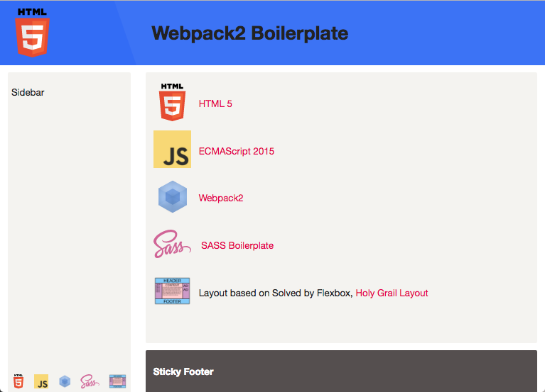

# Webpack2 boilerplate



A Webpack2 boilerplate, partly based on this Egghead.io course; 
[Using Webpack for Production JavaScript Applications](https://egghead.io/courses/using-webpack-for-production-javascript-applications)

## Features
* ES2015/ES2016
* Node6 or Node7
* Npm as a task/build runner
* Webpack2 with tree-shaking and hot module replacement (HMR)
* Webpack DLL plugin for faster builds
* Node Express middleware
* Linting with eslint and stylelint
* Unit tests with Mocha, Chai, Sinon and JsDom
* Integration tests with Node Express server <!--* Acceptance testing with Node Express, Cucumber.js, WDIO, Selenium and PhantomJS -->
* Code coverage and reporting with Istanbul
* SASS boilerplate with Solved by Flexbox Holy Grail example layout
* Self hosting Google Material Icons and Font Roboto
* Framework agnostic. No dependencies to frameworks like React or Angular
* Uses [husky](https://github.com/typicode/husky) to prevent bad commits

### Husky
This project uses [husky](https://github.com/typicode/husky) to run scripts
before an actual `git commit`

More details about Husky can be found here:
* [Prevent bad git commits and pushes with Husky](http://www.penta-code.com/prevent-bad-git-commits-and-pushes-with-husky/)
* [Prevent Bad Commits with husky](https://davidwalsh.name/prevent-bad-commits-husky)

## Get started
* Install Node7 or Node6 (via nvm)
* Clone this repository: `git clone https://github.com/leifoolsen/webpack2-boilerplate.git` (or download zip)
* CD to project directory: `cd webpack2-boilerplate`
* Remove existing git: `rm -rf .git`
* Install dependencies: `npm install`
* Build dll: `npm run build:dll`
* Init your git: `git init`
* Modify `package.json`, e.g. `name, author, description, repository` 
* Add your own 3'rd party dependencies  to `package.json`
* Add those 3'rd party dependencies to `./src/vendor.js` or the `entry.vendor` section in **`webpack.config.dll`**
* Happy hacking :)

>**Note:** Remember to add your own repo to package.json 
```
  "repository": {
    "type": "git",
    "url": "https://github.com/<your-git>/<your-project>.git"
  },
```

## NPM Scripts
* `start`: run Express sever with Hot Module Reloading (HMR), eslint and stylelint, serving files at http://localhost:8084
* `test`: run unit tests and integration tests
* `test:watch`: run unit tests in watch mode
* `test:single`: run a single test file in watch mode, e.g.<br/>`npm run test:single test/unit/logger/logger.spec.js`<br/>`npm run test:single test/integration/server/server.spec.js`
* `test:pattern`: will run tests and suites with names matching the given pattern, e.g.<br/>`pattern=logger npm run test:pattern` will run only the `logger` tests
* `lint`: lint according to rules in `.eslintrc` and `.stylelintrc`
* `analyze`: run webpack-bundle-size-analyzer to analyze the output bundle sizes<br/>Note: There is a `console.log` statement at the top of the `webpack.config` file that must be removed before this script can be run
* `clean`: remove dist and coverage directory
* `build`: bundle the app to the dist dir using development settings
* `build:prod`: bundle the app to the dist dir using production settings
* `server`: run Express sever with the generated bundle, serving files at http://localhost:8000
* `precommit`: husky run command for the git pre-commit hook

## Start coding
* Run: `npm start`
* Open a browser at `http://localhost:8084`
* Press `Ctrl+C` to stop the dev server

### Test the API
* Click the "Ping" button or open a browser at `http://localhost:8000/api/ping`. The response should be: `{"ping":"pong!"}`

## Test the bundle
* `npm run build:prod`
* `npm run server`
* Open a browser at `http://localhost:8000`

## How to use the boilerplate with React
The boilerplate may, with a few modifications, be used with React.
 
### Install required packages
```bash
# dependencies
npm i -S react
npm i -S react-dom

# devdependencies
npm i -D babel-preset-react 
npm i -D react-hot-loader@3.0.0-beta.6
```

### Add React dependencies to `src/vendor.js`
```javascript
if (!window._babelPolyfill) {
  require('babel-polyfill'); // eslint-disable-line global-require
}
import 'moment';
import 'react';
import 'react-dom';
```

### Modify `.babelrc`

```json
{
  "presets": [
    ["env", {
      "targets": {
        "browsers": ["last 2 versions", "ie >= 11"]
      }
    }],
    "react",
    "stage-0"
  ],
  "env": {
    "development": {
      "plugins": [
        "react-hot-loader/babel"
      ]
    },
    "test": {
    },
    "production": {
    }
  }
}
```

### Modify `webpack.config.babel.js`

#### entry.app
Add 'react-hot-loader/patch'

```javascript
app: (!isHot ? [] : [
  './webpack-public-path.js',
  // Put react-hot-loader/patch before webpack-hot-middleware,
  // see: https://github.com/gaearon/react-hot-loader/issues/243
  'react-hot-loader/patch',
  `webpack-hot-middleware/client?path=${path.join(publicPath, '__webpack_hmr')}&reload=true`,
]).concat([
  './styles.scss',
  './index.js'
]),
```

#### modules.rules.test: /\.js[x]?$/
Add 'react-hot-loader/babel'

```javascript
{
  test: /\.js[x]?$/,
  include: [src],
  exclude: [/node_modules/],
  loader: 'babel-loader',
  query: {
    'plugins': isHot ? [
      'react-hot-loader/babel'
    ] : []
  }
},
```

### Start coding React
Enjoy your React coding :-)
