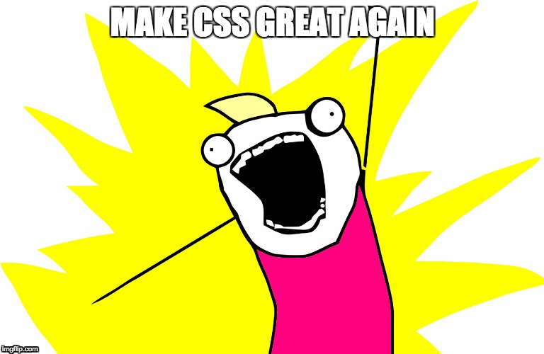
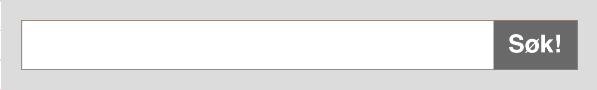
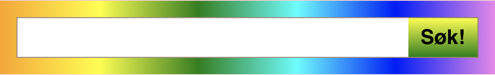
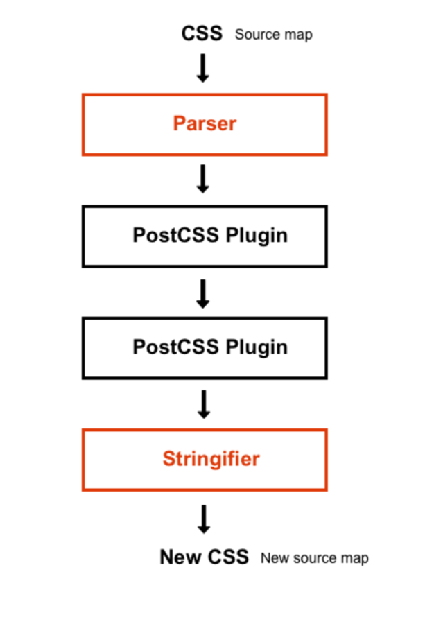

# Dagens CSS
* Globalt navnerom
* Mangler struktur
  * Variabler
  * Operatorer
  * Functions
  * Mixins
  * Nesting
* Modularisering
* Cascading er ikke deterministisk
* Spagetti

# CSS preprosessorer, f.eks. SASS
* Statiske variabler
* Struktur
  * Variabler
  * Operatorer
  * Functions
  * Mixins
  * Nesting
* Fremdeles globalt navnerom

# BEM - Block Element Modifier
* Navngivningsstandard som forsøker å gjøre noe med manglende navnerom
* Ingen garanti for at BEM gir unike navn

```css
.block {
}
.block__element {
}
.block--modifier {
}
```

## Eksempel: Søkefelt med BEM-notasjon


```css
.search {
  display: flex;
  align-items: center;
  margin: 1.5rem auto;
  padding: 1rem;
  font-size: 1.25rem;
  min-width: 10rem;
  max-width: 30rem;
  background: #dcdcdc;
}

.search__input,
.search__submit {
  border: 1px solid rgba(147, 128, 108, 0.9);
  padding: 0.5rem 0.75rem;
}

.search__input {
  flex: 1;
  border-right: 0;
}

.search__submit {
  font-weight: 600;
  border-left: 0;
  background: #696969;
  color: #ffffff;
}
```

```html
<div class="search"> 
  <input type="text" id="some-id" class="search__input"> 
  <button type="submit" class="search__submit">Search</button> 
</div>
```
## Søkefelt med "livlige" farger


```css
.search--vivid {
  background: linear-gradient(to right, orange, yellow, green, cyan, blue, violet);
}

.search__submit--vivid {
  background: linear-gradient(to bottom, yellow, green);
  color: #000000;
}

.search__submit--vivid:active {
  background: linear-gradient(to top, yellow, green);
}

```

```html
<div class="search search--vivid"> 
  <input type="text" id="vivid-id" class="search__input"> 
  <button type="submit" class="search__submit search__submit--vivid">Search</button> 
</div>
```

# PostCSS

>“PostCSS is a tool for transforming CSS with JS plugins. 
These plugins can support variables and mixins, transpile 
future CSS syntax, inline images, and more.“



* **Ikke** et postprosesseringsverktøy!
* Et rammeverk som består av en CSS-parser, et plugin API og en stringifier
* Modulært
* Plugins installeres etter behov
  * Mer enn 200 plugins å velge mellom
  * Linting, Optimalisering, Fallbacks, Minifisering, osv
  * stylelint, autoprefixer, import, css-variables, mixins, cssnext, cssnano, osv
* Erstatter (langt på vei) preprosesseringsverktøy som SASS  
* Kan benyttes sammen med SASS

## Autoprefixer
```css
.block {
  display: flex;
}
```

```css
.block {
  display: -webkit-flex;
  display: -moz-flex;
  display: -ms-flex;
  display: -o-flex;
  display: flex;
}
```

## postcss-cssnext

>PostCSS plugin to use tomorrow’s CSS syntax, today.

Forenkler bruken av plugins ved å integrere et sett med "standardiserte" plugins fra 
PostCSS økosystemet. Transformerer CSS skrevet i den kommenede 
W3C CSS-standarden til CSS som kan benyttes i dagens nettlesere. 
`postcss-cssnext ≈≈≈ Babel for CSS`

* Custom variables and properties
* Calc
* Custom media queries
* Custom selectors
* Filters
* +++


## Custom Properties (CSS variables)

```css
:root {
  --container-width: 800px;
  --container-padding: 0 16px;
}

.container {
  width: var(--container-width);
  padding: var(--container-padding);
}
```

`:root` "leses" som `html`, men har høyere prioritet. 

#### Kompilerer til
```css
.container {
  width: 800px;
  padding: 0 16px;
}
```

### Eksempel på lovlige variabler

En customproperty kan være et hvilken som helst lovlig CSS-uttrykk.

```css
:root{
  --main-color: #4d4e53;
  --main-bg: rgb(255, 255, 255);
  --logo-border-color: rebeccapurple;

  --header-height: 68px;
  --content-padding: 10px 20px;

  --base-line-height: 1.428571429;
  --transition-duration: .35s;
  --external-link: "external link";
  --margin-top: calc(2vh + 20px);

  /* Valid CSS custom properties can be reused later in, say, JavaScript. */
  --foo: if(x > 5) this.width = 10;
}
```

### Fallback (default value)

```css

```

### Cascading Custom Properties

```css

```

### CSS-Wide Keywords And The all Property

* `inherit`
  * This CSS keyword applies the value of the element’s parent.
* `initial`
  * This applies the initial value as defined in the CSS specification (an empty value, or nothing in some cases of CSS custom properties).
* `unset`
  * This applies the inherited value if a property is normally inherited (as in the case of custom properties) or the initial value if the property is normally not inherited.
* `revert`
  * This resets the property to the default value established by the user agent’s style sheet (an empty value in the case of CSS custom properties).


### Calc: `+, -, *, /`
```css
:root {
  --gutter: 16px;
}

.container {
  margin: calc(var(--gutter) * 2) var(--gutter);
}
```

#### Kompilerer til

```css
.container {
  margin: 32px 16px;
}
```


### Custom Media

```css
@custom-media --media-tablet (min-width: 840px);
@custom-media --media-desktop (min-width: 1024px);

:root {
  --gutter: 0.25rem;
}

@media (--media-tablet) {
  :root {
    --gutter: 0.5rem;
  }
}

@media (--media-desktop) {
  :root {
    --gutter: 1rem;
  }
}

.search {
  margin: calc(var(--gutter) * 2) auto;
  padding: var(--gutter);
}
```

#### Kompilerer til

```css
.search {
  margin: 0.5rem auto;
  padding: 0.25rem;
}

@media (min-width: 840px) {
 .search {
   margin: 1rem auto;
   padding: 0.5rem;
 }
}

@media (min-width: 1024px) {
 .search {
   margin: 2rem auto;
   padding: 1rem;
 }
}
```

### I steinalderen (for ca to år siden) gjorde vi det slik
```css
@custom-media --media-tablet (min-width: 840px);
@custom-media --media-desktop (min-width: 1024px);

:root {
  --gutter-sm: 0.25rem;
  --gutter-md: 0.5rem;
  --gutter-lg: 1rem;
}

.search {
  margin: calc(var(--gutter-sm) * 2) auto;
  padding: var(--gutter-sm);
  
  @media (--media-tablet) {
    margin: calc(var(--gutter-md) * 2) auto;
    padding: var(--gutter-md);
  }

  @media (--media-desktop) {
    margin: calc(var(--gutter-lg) * 2) auto;
    padding: var(--gutter-lg);
  }
}
```

### Custom Selector

```css
@custom-selector :--headings h1, h2, h3, h4, h5, h6;

:--headings {
  color: mediumblue;
}
```

#### Kompilerer til
```css
h1,
h2,
h3,
h4,
h5,
h6 {
  color: mediumblue;
}
```

### @import

`custom-media.css`

```css
@custom-media --media-tablet (min-width: 840px);
@custom-media --media-desktop (min-width: 1024px);
```

`layout.css`
```css
@import './custom-media.css';

.layout-body {
  display: flex;
  flex: 1 0 auto; /* 2 */
  flex-direction: column;
  padding: 0;
}

@media (--media-tablet) {
  .layout-body {
    /* flex-direction: row; */
    flex-flow: row wrap;
  }
}
```

### @apply
Opererer på et sett med variabler

```css
:root {
  --flex-row: {
    display: flex;
    flex-wrap: wrap;
    align-items: center;
    justify-content: space-around;
  }
}
.flex-row {
  @apply --flex-row;
}
```
Kjekt, men blir ikke en del av standarden :-(

>You are using @apply rule and custom property sets. 
>This feature won't be included in next the major release of postcss-cssnext. 
>This most likely won't get any more support from browser vendors as the spec 
>is yet considered deprecated and alternative solutions are being discussed.


# CSS Modules

>“A CSS Module is a CSS file in which all class names and animation names are 
<span style="font-size:120%; color: blue; font-weight: 600;">scoped locally</span> by default.“

## Hvordan virker det
Siden CSS'en er i et navnerom, trenger vi ikke lengre å bruke hjernekapasitet på
å lage kreative CSS-navn. `smia-layout__row__detail` og 
`smia-layout__row__detail--highlight` kan forenkles til f.eks. `detailRow` og 
`highlightedDetailRow`.

### 1: Aktiver CSS Modules i Webpack

```js
modules: true,
localIdentName: '[name]__[local].[hash:base64:5]',
```

### 2: Aktiver nødvendige PostCSS plugins i `postcss.config.js`

```js
module.exports = {
  plugins: [
    require('postcss-import')(), 
    require('postcss-url')(),    
    require('postcss-mixins')(),  
    require('postcss-cssnext')({
      features: {
        customProperties: false,
        rem: false,             
      }                         
    }),                                  
    require('postcss-css-variables')()
  ]
}
```

### 3: Fjern BEM

```css
.normal {
  display: flex;
  align-items: center;
  margin: 1.5rem auto;
  padding: 1rem;
  font-size: 1.25rem;
  min-width: 10rem;
  max-width: 30rem;
  background: #dcdcdc;
}

.input,
.submit {
  border: 1px solid rgba(147, 128, 108, 0.9);
  padding: 0.5rem 0.75rem;
}

.input {
  flex: 1;
  border-right: 0;
}

.submit {
  font-weight: 600;
  border-left: 0;
  background: #696969;
  color: #ffffff;
}
```

### 4: Importer stilarket

```js
import search from './search.css';

/** @jsx h */
import {h} from 'hyperapp';

export const searchView = () =>
  <div className={search.normal}> 
    <input type="text" id="some-id" className={search.input}> 
    <button type="submit" className={search.submit}>Search</button> 
  </div>;
```

#### Genert markup
```html
<div class="search__normal-1I9c1" role="search">
  <input id="some-id" class="search__input-1a6V3" type="text">
  <button class="search__submit-3rJL2">Søk!</button>
</div>
```

### 5: Composition


```css
.vivid {
  composes: normal;
  background: linear-gradient(to right, orange, yellow, green, cyan, blue, violet);
}

.submit-vivid {
  composes: submit;
  background: linear-gradient(to bottom, yellow, green);
  color: #000000;
  
  &:active {
    margin-top: calc(var(--baseline) - var(--font-size-1) + var(--baseline));
  }
}
```

### 6: Endre CSS-klassenavn i markup

```js
import search from './search.css';

/** @jsx h */
import {h} from 'hyperapp';

export const searchView = () =>
  <div className={search.vivid}> 
    <input type="text" id="some-id" className={search.input}> 
    <button type="submit" className={search['submit-vivid']}>Search</button> 
  </div>;
```

#### Genert markup
```html
<div class="search__vivid-3lM3T search__normal-1I9c1" role="search">
  <input id="some-id2" class="search__input-1a6V3" type="text">
  <button class="search__submit-vivid-1p_TL search__submit-3rJL2">Søk!</button>
</div>
```

## Global CSS i CSS Modules
* Stiling av HTML-tagger, som `<div>`, havner alltid i globalt navnerom
* Man kan også definere globale CSS-klasser ved å benytte `:global` foran CSS-klassen

```css
:global(.clearfix::after) {
  clear: both;
  content: '';
  display: table;
}
```

# PostCSS / CSS Modules i Webpack

## .stylelintrc
```json
{
  "extends": [
    "stylelint-config-standard",
    "stylelint-config-css-modules"
  ],
  "rules": {
    "at-rule-empty-line-before": null,
    ...
  }
}
```

## postcss.config.js

```js
const isDev = process.env.NODE_ENV !== 'production';
const isProd = process.env.NODE_ENV === 'production';

plugins = () => {
  let result = [
    require('postcss-import')({ /* ...options */ }),        // CSS import
    require('postcss-url')({ /* ...options */ }),           // Rebase, inline or copy on url()
    require('postcss-mixins')({ /* ...options */ }),        // PostCSS plugin for mixins
    require('postcss-cssnext')({                            // Use tomorrow's CSS syntax, today :-)
      features: {
        customProperties: false,                            // Use 'postcss-css-variables' insted of 'postcss-custom-properties',
        rem: false,                                         // Disable px fallback for rem/em
      }                                                     // See: http://cssnext.io/usage/
    }),                                                     // Require 'postcss-cssnext' AFTER "postcss-import"
    //                                                      // This is the difference between cssnext working or not
    //                                                      // See: https://medium.com/written-with-envy/webpack-2-postcss-cssnext-fdcd2fd7d0bd
    require('postcss-css-variables')({ /* ...options */ }), // Transform CSS Custom Properties(CSS variables) syntax into a static representation
    //                                                      // The 'postcss-custom-properties' plugin does not support CSS variables inside media queries and the like
    //                                                      // This plugin is required until the 'postcss-custom-properties' supports this feature
  ];

  if (isDev) {
    result.concat([
      require('postcss-reporter')(),
      require('postcss-browser-reporter')(),                // Error reporting when the build fails
    ]);
  }

  if (isProd) {
    result.concat([
      require("cssnano")({ autoprefixer: false }),
    ]);
  }

  return result;
};

module.exports = {
  plugins: plugins()
};

```

## Webpack
```js
const isDev = process.env.NODE_ENV !== 'production';
const isProd = process.env.NODE_ENV === 'production';

...
plugins: [
  new StyleLintPlugin({
    configFile: path.resolve(process.cwd(), '.stylelintrc'),
    files: '**/*.css',
    failOnError: isProd
  }),
],
module: {
  rules: [
    {
      test: /\.css$/,
      include: [
        src,
        path.resolve(process.cwd(), 'node_modules')
      ],
      use: ExtractTextPlugin.extract({
        fallback: 'style-loader',
        use: [
          {
            loader: 'css-loader',
            options: {
              url: true,
              sourceMap: true,
              importLoaders: 1,
              modules: true,
              localIdentName: isDev ? '[name]__[local].[hash:base64:5]' : '[hash:base64:5]',
              minimize: isProd
            }
          },
          {
            loader: 'postcss-loader',
            options: {
              sourceMap: true,
            }
          },
        ]
      })
    },
  ]
},
...
```
