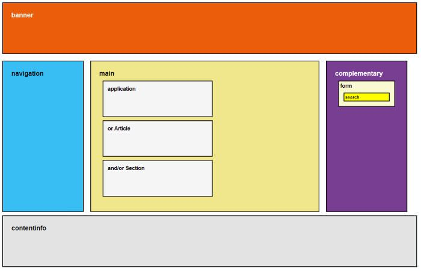

# WAI-ARIA in HTML 5



## Landmark roles
Document landmark roles are a subset of regular roles, they are semantic extenders that provide training wheels for 
semantic elements that don’t exist or haven’t been adopted fully by all browsers.

A landmark is a type of region on a page to which the user may want quick access. Content in such a region is different 
from that of other regions on the page and relevant to a specific user purpose, such as navigating, searching, perusing
the primary content, etc.

Adding ARIA landmarks to your existing site, or to a site you are developing, provides useful global navigation features 
and aids understanding of content structure for users. Over time the necessity of explicitly assigning landmarks
will lessen as browsers build in ARIA landmark roles to newer HTML element semantics. There is widespread support for 
ARIA landmarks in browsers and screen readers.

WAI-ARIA landmark roles should be allpied to the main sections of a HTML page.

WAI-ARIA defines the following document landmark roles:

| Role          | Description
|---------------|------------
| application   | A region declared as a web application, as opposed to a web document. **note**: It is strongly recommended that role="application" be used very sparingly.
| banner        | A region that contains mostly site-oriented content, rather than page-specific content. **Note:** Within any document or application, the author SHOULD mark no more than one element with the banner role.
| complementary | A supporting section of the document, designed to be complementary to the main content at a similar level in the DOM hierarchy, but remains meaningful when separated from the main content. For example, in the case of a portal, this may include but not be limited to show times, current weather, related articles, or stocks to watch. The content should be relevant to the main content; if it is completely separable, a more general role should be used instead.
|contentinfo    | A large perceivable region that contains information about the parent document. **Note**: Within any document or application, the author SHOULD mark no more than one element with the contentinfo role.
| form          | A landmark region that contains a collection of items and objects that, as a whole, combine to create a form. See related search.
| main          | The main content of a document. **Note**: Within any document or application, the author SHOULD mark no more than one element with the main role.
| navigation    | A collection of navigational elements (usually links) for navigating the document or related documents.
| search        | A landmark region that contains a collection of items and objects that, as a whole, combine to create a search facility. See related form.
| artichle      | Article (content that makes sense in its own right such as a complete blog post)
| section       | a blob of content that you could store as an individual record in a database. It generally looks like this (and note that the heading goes inside the section element, not immediately before it)

### Comparing HTML 5 to WAI-ARIA

| HTML 5	    | ARIA Role            | Descrption
|-------------|----------------------|------------
| `<header>`	| role="banner"        | Introduction to a page or section. Can contain a heading (H1-H6), site logo, navigation.
| `<nav>`     | role="navigation"    | Can be used for various types of navigation such as site navigation, sub-navigation, breadcrumbs, previous/next links.
| `<main>`	  | role="main"          | The primary purpose of `<main>` is to map ARIA’s landmark role main to an element in HTML. This will help screen readers and other assistive technologies understand where the main content begins.
| `<aside>`	  | role="complementary" | Information that is tangentially related to the main page content, but can be read separately. Visually you might see this as a sidebar.
| `<footer>`	| role="contentinfo"   | Describes the page or a section of the page. A page’s footer may contain author name, copyright info, privacy policy, etc.
| `<section>` | role="region"        | (1)
| `<article>` | role="article"       | (1)
| none	      | role="search"        | (1)
| `<form>`	  | role="form"          | (1)
| `<span>`    |                      | (2)
| `<div>`     |                      | (2)

>(1) The region, article, search and form roles are not ARIA landmarks<br/>
>(2) Span an div elements have weak roles - they are semantically neutral. Does not have any (landmark) roles.


### A bare bone HTML5 example page with landmark roles

```html
<!DOCTYPE html>
<html>
<head>
  <meta charset="utf-8">
  <meta http-equiv="X-UA-Compatible" content="IE=edge">
  <meta name="viewport" content="width=device-width, initial-scale=1">
  <title></title>
</head>
<body>
  <header role="banner">
  </header>
  <nav role="navigation">
  </nav>
  <main role="main">
  <article>
    <header>
      <h1>...</h1>
      <p>...</p>
    </header>
    <p>...</p>
    <footer>
      <p>....</p>
    </footer>
  </article>  
  </main>
  <aside role="complementary">
  </aside>
  <footer role="contentinfo">
  </footer>
</body>
</html>
```

### A more complete HTML5 example page with ARIA roles and meta tags

```html
<!DOCTYPE html>
<html>
<head>
  <meta charset="utf-8">
  <meta http-equiv="X-UA-Compatible" content="IE=edge">
  <meta name="viewport" content="width=device-width, initial-scale=1">
  <title>Mastering RWD with HTML5 &amp; CSS3</title>
  <link rel="stylesheet" href="css/site-styles.css">
</head>
<body>
  <header class="masthead" role="banner">
    <div class="logo">HTML 5 and WAI-ARIA landmark roles</div>
    <div class="search" role="search">
      <form>
       <label>Search:
        <input type="text" class="field">
        <button>Search Now!</button>
       </label>
      </form>
    </div>
  </header>
  <nav class="main-nav" role="navigation">
    <ul class="nav-container">
      <li><a href="#">Link 1</a></li>
      <li><a href="#">Link 2</a></li>
      <li><a href="#">Link 3</a></li>
      <li><a href="#">Link 4</a></li>
    </ul>
  </nav>
  <main class="main-container" role="main">
    <h1>Marking Our Content with HTML5</h1>
    <p>....</p>
    <article class="article-container flex-container">
       <section class="main-content">
          <header>
             <h1>The <code>&lt;main></code> element</h1>
          </header>
          <p>As per the MDN definition:</p>
          <blockquote>
             <p>The HTML Main Element (<code>&lt;main></code>) represents&hellip;</p>
          </blockquote>
       </section>
       <aside class="side-content" role="complementary">
          <h2>What Does "Semantic HTML" Mean?</h2>
          <p>Semantic markup basically means that we use HTML tags to describe what a specific piece of content is.</p>
       </aside>
    </article>
    <div class="contact-form" role="form">
       <header>
          <h2>Have Questions About HTML5?</h2>
       </header>
       <form>
          <div class="flex-container">
             <label class="label-col">Name: <input type="text" class="field name" id="name" required></label>
             <label class="label-col">Email: <input type="email" class="field email" id="email" required></label>
          </div>
          <label for="comments">Comments:</label>
          <textarea class="comments" id="comments" cols="50" required></textarea>
          <button>Send Question!</button>
       </form>
    </div>
    <footer class="main-footer" role="contentinfo">
       <p>Copyright &copy;</p>
       <ul class="nav-container" role="navigation">
          <li><a href="#">Footer Link 1</a></li>
          <li><a href="#">Footer Link 2</a></li>
          <li><a href="#">Footer Link 3</a></li>
          <li><a href="#">Footer Link 4</a></li>
          <li><a href="#">Footer Link 5</a></li>
       </ul>
    </footer>
  </main>
</body>
</html>
```

## HTML5 Sectioning Element Flowchart

An easy-to-understand HTML5 sectioning element flowchart to help you get to grips with some of the new elements in HTML5.
From the [html5 Doctor](http://html5doctor.com/resources/)


## `<main>`

Use the main element to mark up the main content area of a document.

The primary purpose of `<main>` is to map ARIA’s landmark role main to an element in HTML. This will help screen readers 
and other assistive technologies understand where the main content begins.

One important facet of `<main>` is that it can only be used once per page.

```html
<body>
  <main role="main">
    <p>Content goes here</p>
  </main>
</body>
```

## `<section>` and  `<article>`

### `<section>`
The section element represents a generic document or application section… The section element is not a generic container 
element. When an element is needed only for styling purposes or as a convenience for scripting, authors are encouraged
to use the div element instead. **A general rule is that the section element is appropriate only if the element’s 
contents would be listed explicitly in the document’s outline.**

`<section>` is a blob of content that you could store as an individual record in a database. It generally looks like 
this (and note that the heading goes inside the section element, not immediately before it)

```html
<body>
...
<section>
  <h2>level of heading = section nesting level</h2>
  ... rest of the content
</section>
...
</body>
```

With very few exceptions, section should not be used if there is no natural heading for it.

The theme of each section should be identified, typically by including a heading (h1–h6 element) as a child of the 
section element.

Rules of thumb for using section

Of course, there are always exceptions, but these should give useful guidance for 99% of cases:

* Don’t use it just as hook for styling or scripting; that’s a div
* Don’t use it if article, aside or nav is more appropriate
* Don’t use it unless there is naturally a heading at the start of the section
* The spec says: Authors are encouraged to use the article element instead of the   
  section element when it would make sense to syndicate the contents of the element.

### `<article>`
Content that makes sense in its own right such as a complete blog post

**W3C Specification**
The article element represents a component of a page that consists of a self-contained composition in a document, page, 
application, or site and that is intended to be independently distributable or reusable, e.g. in syndication. This could 
be a forum post, a magazine or newspaper article, a blog entry, a user-submitted comment, an interactive widget or gadget, 
or any other independent item of content.

A complete, or self-contained, composition in a document, page, application, or site and that is, in principle, 
independently distributable or reusable, e.g. in syndication. This could be a forum post, a magazine or newspaper 
article, a blog entry, a user-submitted comment, an interactive widget or gadget, or any other independent item of content.

Don’t think of <article> as a magazine article. Think of it as an article of clothing, an independent entity that can be 
arranged in conjunction with other articles of clothing, but is a complete thing in itself.

```html
<article>
  <header>
    <h1>Apple</h1>
    <p>Published: <time pubdate="pubdate">2009-10-09</time></p>
  </header>
  <p>The <b>apple</b> is the pomaceous fruit of the apple tree...</p>
  ...
  <footer>
    <p><small>Creative Commons Attribution-ShareAlike License</small></p>
  </footer>
</article>
```
See [The article element @ HTML Doctor](http://html5doctor.com/the-article-element/)

### The difference between `<article>` and `<section>`

The `<article>` element is a specialised kind of `<section>`; it has a more specific semantic meaning than `<section>` in 
that it is an independent, self-contained block of related content. We could use `<section>`, but using `<article>` gives 
more semantic meaning to the content.

By contrast `<section>` is only a block of related content, and `<div>` is only a block of content. Also as mentioned 
above the pubdate attribute doesn’t apply to `<section>`. To decide which of these three elements is appropriate, choose 
the first suitable option:

1. Would the content make sense on its own in a feed reader? If so use `<article>`
2. Is the content related? If so use `<section>`
3. Finally if there’s no semantic relationship use `<div>`

See: [HTML5 Sectioning Element Flowchart](http://html5doctor.com/resources/#flowchart)


## `<header>`
According to the HTML spec the header element represents

…introductory content for its nearest ancestor sectioning content or sectioning root element. A header typically 
contains a group of introductory or navigational aids.

When the nearest ancestor sectioning content or sectioning root element is the body element, then it applies to the 
whole page.

### Adding ARIA to `<header>`

The HTML spec advises the following, for the `<header>` element:
* Allowed ARIA role attribute values: banner role (default – do not set) or presentation.
* Allowed ARIA state and property attributes:Global aria-* attributes
* Any aria-* attributes applicable to the allowed roles.

**Note:** the banner role is only mapped to `<header>` when the element is not within a `<section>` or `<article>` 
element, i.e. when `<header>` is scoped to the `<body>` element. This mapping has been implemented in browsers to avoid 
exposing banner role semantics inappropriately.

```html
<header class="masthead" role="banner">
  ... main header content goes here
</header>
```

## `<footer>`

The footer element represents a footer for its nearest ancestor sectioning content or sectioning root element. A footer 
typically contains information about its section such as who wrote it, links to related documents, copyright data, and 
the like.

```html
<footer>
  <ul>
    <li>copyright</li>
    <li>sitemap</li>
    <li>contact</li>
    <li>to top</li>
  </ul>
</footer>
```

An important point to note is that you are not restricted to use one `<footer>` element per site, you can use multiple 
footers, each of which will then become the `<footer>` for that section of the document. You could therefore have a 
`<footer>` for a `<section>` or an `<article>`.

```html
<section>
   Section content appears here.
   <footer>
   Footer information for section.
   </footer>
</section>

<article>
   Article content appears here.
   <footer>
   Footer information for article.
   </footer>
</article>
```

## `<aside>`
When used within an article element, the contents should be specifically related to that article (e.g., a glossary). 
When used outside of an article element, the contents should be related to the site (e.g., a blogroll, groups of 
additional navigation, and even advertising if that content is related to the page).

The two uses of aside can be best illustrated with an example:

```html
<body>
  <header>
    <h1>My Blog</h1>
  </header>
  <article>
    <h1>My Blog Post</h1>
    <p>Lorem ipsum dolor sit amet, consectetur adipisicing elit, sed do
    eiusmod tempor incididunt ut labore et dolore magna aliqua.</p>
    <aside>
      <!-- Since this aside is contained within an article, a parser
      should understand that the content of this aside is directly related
      to the article itself. -->
      <h1>Glossary</h1>
      <dl>
        <dt>Lorem</dt>
        <dd>ipsum dolor sit amet</dd>
      </dl>
    </aside>
  </article>

  <aside role="complementary">
    <!-- This aside is outside of the article. Its content is related
    to the page, but not as closely related to the above article -->
    <h2>Blogroll</h2>
    <ul>
      <li><a href="#">My Friend</a></li>
      <li><a href="#">My Other Friend</a></li>
      <li><a href="#">My Best Friend</a></li>
    </ul>
  </aside>
</body>
```

The aside element can now represent secondary content when used outside of an
article. Keep in mind that aside — and, more generally, secondary content — does
not necessarily mean “sidebar”. The style of the content should not dictate the
use of the element. For content that is not the primary focus of an article
(or page) but is still related to the article (or page), aside is what you need,
regardless of its visual design.

## `<nav>`

The nav element represents a section of a page that links to other pages or to
parts within the page: a section with navigation links. Not all groups of links
on a page need to be in a nav element only sections that consist of major
navigation blocks are appropriate for the nav element. In particular, it is
common for footers to have a list of links to various key parts of a site, but
the footer element is more appropriate in such cases, and no nav element is
necessary for those links.

```html
<nav>
  <ul>
    <li><a href="index.html">Home</a></li>
    <li><a href="/about/">About</a></li>
    <li><a href="/blog/">Blog</a></li>
  </ul>
</nav>
```


## `<detail>` and `<summary>`

This is designed to produce an “expando” box that is closed by default
(but can be open by default using the boolean open attribute), only displaying
the text specified by the summary as a control. Activating that control opens
the whole details element; re-activating closes it again. If no summary text is
present, the browser defaults to the rubric “details”. (Added 4 Feb 10:) In
browsers that support details, this behaviour does not depend on author scripting,
and should work even if JavaScript is disabled or not present.

```html
<details>
  <summary>More information</summary>
  <p>Here is the source data that is discussed in the article ... </p>
</details>
```

>Note: The detail/summary is not widely adopted by browsers, so a polyfill may be required. See e.g. [lavu-details-polyfill](https://github.com/leifoolsen/lavu-details-polyfill)  

## `<figure>` and `<figcaption>`

The `<figure>` element is intended to be used in conjunction with the `<figcaption>`
element to mark up diagrams, illustrations, photos, and code examples (among
other things).

**W3C Specification**  
The figure element represents a unit of content, optionally with a caption,
that is self-contained, that is typically referenced as a single unit from the
main flow of the document, and that can be moved away from the main flow of
the document without affecting the document’s meaning.

**W3C Specification**  
The figcaption element represents a caption or legend for a figure.


```html
<figure>
   (or video, table etc)
  <figcaption>A rabid unicorn goring a fairy.</figcaption>
</figure>
```

```html
<figure aria-labelledby="operahouse_1" role="group">
  
  <figcaption id="operahouse_1">We saw the opera <cite>Barber of Seville</cite> here!</figcaption>
</figure>
```


## `<address>`
The `<address>` element is one of the most commonly misunderstood HTML elements.
This element is not for marking up postal address, but rather for representing
the contact information for an article or web page. This could be a link to
the author’s website or their email address.

This element is often used within the `<footer>` for an `<article>`.

```html
<article>
  <header>
    <h1>Google buys Nest</h1>
    <p>Posted at 11:34am 13th January 2014</p>
  </header>
  <p>...</p>
  <p>...</p>
  <footer>
    <address>
      By <a href="mailto:matt@example.com">Matt West</a>
    </address>
    <p>Copyright Matt West 2014</p>
  </footer>
</article>
```


# ARIA roles, states and attributes
The roles, their characteristics, the states and properties they support, and specification of how they may be used in 
markup, shall be considered normative.

**ARIA roles**
20+ roles, including

* alert
* dialog
* gridcell
* menuitem
* progressbar
* slider
* tooltip

**ARIA states**
9 states, including

* aria-checked
* aria-pressed
* aria-hidden
* aria-invalid

**ARIA attributes**
20+ attributes, including

* aria-controls
* aria-describedby
* aria-label
* aria-level
* aria-haspopup


## Use Default implicit ARIA semantics where possible
Default implicit [ARIA semantics](http://www.w3.org/TR/html-aria/#sec-strong-native-semantics)
refers to semantics that are already applied to
an element by the browser. Elements such as nav, article and button have default
implicit ARIA statements of `role="navigation"`, `role="article"` and `role="button"`
respectively. Before semantic HTML elements existed, it was common to have
elements such as `<div class="main-navigation" role="navigation">`. Now we are
able to use nav in place of div, but we no longer need to add `role="navigation"`
because this is already implied. You can refer to this [W3C table](http://www.w3.org/TR/html-aria/#docconformance)
to check whether or not an ARIA attribute is required for a certain element.

* An element can only have one role
* Do not change native semantics

## role="presentation"
Used when an element is simply for presentation. If you imagine someone using a
screen reader, think of the elements that they would not want read out. One
example is an element that might contain a visual decoration, or is an empty
element simply serving an image or background color.

```html
<a href="some-url/x.html" role="presentation">
  
</a>
```

## role="group"
A set of user interface objects which are not intended to be included in a page
summary or table of contents by assistive technologies.

Contrast with region which is a grouping of user interface objects that will be
included in a page summary or table of contents.

## role="dialog"
By using the role dialog and the WAI-ARIA attributes aria-labelledby and
aria-descibedby on the same element, we provide additional information to AT.

```html
<div id="myDialog" role="dialog"
   aria-labelledby="myTitle"
   aria-describedby="myDesc">
  <div id="myTitle">Save changes?</div>
  <button id="saveMe" type="button"> Yes </button>
  <button id="discardMe" type="button">No </button>
  <button id="neverMind" type="button">Cancel </button>
</div>
```

* If you use the role “dialog”, you must use aria-labelledby to point to the element containing the visible dialog title. The aria-labelledby attribute must be on the same HTML element as the role “dialog” attribute.
* If your dialog has one main descriptive text, you must use aria-describedby to point to its element, also on the same element that has role “dialog”.

```html
<main id="mainPage" role="main"
  aria-hidden="true">
  <div id="modal" role="dialog"
     aria-hidden="false"
     aria-labelledby="modalTitle"
     aria-describedby="modalDescription">
  </div>
</main>
```

* When the modal dialog is displayed, the mainPage is marked with aria-hidden='true' to prevent screen readers from interacting with it once the modal dialog is open.
* By using state aria-hidden and properties aria-labelledby and aria-describedby, we increase accessibility for the modal dialog for the AT user.

Modal windows should be used instead of pop-up windows, and should be made
accessible with WAI-ARIA. In a modal dialog screen-readers will speak the title,
the text, and the currently focused button automatically. In the following
example the title is called “modalTitle” and the text is called “modalDescription”.

```html
<main id="mainPage" role="main"
    aria-hidden="true">
  <div id="modal"
     role="dialog"
     aria-labelledby="modalTitle"
     aria-describedby="modalDescription"
     aria-hidden="false">
    <div id="modalDescription" class="screen-reader-offscreen">
      Beginning of modal dialog window example. Escape will cancel and close the window.
    </div>
    <h1 id="modalTitle">Modal dialog window example</h1>
    <p>
      These are the onscreen instructions that are not attached explicitly to a focusable element.
      Can screen reader users read this text with the virtual cursor?
    </p>
    <button id="modalCloseButton" title="Close modal dialog window">
      
    </button>
  </div>
</main>
```

Remember that WAI-ARIA merely provides semantic information. It does not
automatically introduce certain types of behaviour. You have to use JavaScript
to do that. To ensure accessibility remember the following:

* Set focus on the first keyboard focusable element within the dialog
* Trap keyboard focus and create a natural tab order inside the dialog
* Provide an escape route
* Restore focus after closing the dialog

```javascript
function showModal(dialog) {
  // save current focus
  focusedElementBeforeModal = document.activeElement;

  // Focuses the close button
  dialog.find('button:last-of-type').focus()
  document.getElementById('mainPage').setAttribute('aria-hidden','true');
  document.getElementById('modal').setAttribute('aria-hidden','false');
}

function hideModal() {
  // Moves focus back on closing the dialog
  focusedElementBeforeModal.focus();
  document.getElementById('mainPage').setAttribute('aria-hidden','false');
  document.getElementById('modal').setAttribute('aria-hidden','true');
}
```

## aria-labelledby
The aria-labelledby attribute is similar to aria-describedby in that both
reference other elements to calculate a text alternative. However, a label
should be concise, whereas a description is intended to provide more detailed
information. Depending on the type of screen-reader that is used, the attributes
aria-labelledby and aria-describedby will either be announced upon opening the
dialog, or they will be available to read via the virtual cursor.

```html
<svg version="1.1" width="300" height="200" aria-labelledby="title">
  <title id="title">Green rectangle</title>
  <rect width="75" height="50" rx="20" ry="20" fill="#90ee90" stroke="#228b22" />
</svg>
```


An Example Using Semantic HTML and ARIA, Taking Accessibility into Account

* uses semantic HTML for an image and its caption
* uses the `cite` element appropriately
* provides appropriate `alt` text
* uses one of the ARIA attributes I’ve already mentioned

```html
<figure aria-labelledby="operahouse_1" role="group">
  
  <figcaption id="operahouse_1">We saw the opera <cite>Barber of Seville</cite> here!</figcaption>
</figure>
```


## aria-describedby
Identifies the element (or elements) that describes the object.

```html
<svg version="1.1" width="300" height="200" aria-labelledby="title" aria-describedby="desc" role="img">
  <title id="title">Green rectangle</title>
  <desc>A light green rectangle with rounded corners and dark green borders</desc>
  <rect width="75" height="50" rx="20" ry="20" fill="#90ee90" stroke="#228b22" />
</svg>
```

## aria-describedat
Specifies a URI referencing content that describes the object.

```html

<dl id="moon-data">
  <dt>Jupiter</dt>
  <dd>67 moons</dd>
  <dt>Saturn</dt>
  <dd>62 moons</dd>
  <dt>Neptune</dt>
  <dd>14 moons</dd>
  <dt>Uranus</dt>
  <dd>27 moons</dd>
</dl>
```
**Note:** Can use hidden attribute on dl, will be recognized by aria-describedat.

## hidden and aria-hidden
If an element has a hidden attribute, an aria-hidden attribute is not required.

In browsers that support the hidden attribute there is no need to use
`aria-hidden=true`. Similarly there is no need to use `aia-hidden="true"`
with CSS  `display:none`

 **hidden effects:**
* In supporting browsers the content is not displayed to any user.
* semantic indicator of state in HTML code (hidden attribute)
* CSS style of display:none applied by browser.
* Focusable content is not included in tab order.
* Not included in the accessibility tree.

## required and aria-required
We do not nedd both! If an element has a required attribute, an aria-required
attribute is not required.

Use the aria-required attribute on any element that is allowed the required
attribute in HTML5.


## Live regions for dynamic content, aria-live, aria-atomic, aria-busy

Discovering dynamically updated content without page reload is one of the
biggest obstacles for screen readers, especially in the days of Ajax, Node,
and single-page applications. How should these be handled? Should the whole
page be spoken again? Or should the AT do nothing, risking that the user will
miss important updates?

To fill this gap, ARIA established the concept of live regions that allow ATs to
be notified whenever there are changes in that particular part of the document.

```html
<div id="myTabContent" class="tab-content" aria-live="polite">
    ...
</div>
```

The aria-live property has a value indicating one of three verbosity levels in a region:

* Off: This indicates that the region is not live
* Polite: This indicates that it is not necessary to respond until user completes their current activity
* Assertive: This value is a higher priority than normal, but does not necessarily interrupt the user immediately

```html
<ul aria-live="off">
<ul aria-live="polite">
<ul aria-live="assertive">
```
**Aria-atomic**: Indicates if AT should present all or only part of the changed
region to the user. It has the values true or false. If this property is set to
true, AT should present the entire region as a whole.

In the following example, all elements within an unordered list will be
announced in their entirety when the region is spoken, unless another element
further down the chain overrides the aria-atomic property.

```html
<ul aria-atomic="true"
    aria-live="polite">
```

**Aria-busy**: Prevents AT announcing changes before the updates are complete.
It has the values true or false. If multiple parts of a live region need to be
loaded before changes are announced to the user, the aria-busy property can be
set to true until the final part is loaded, and then set to false when the
updates are complete.

```html
<ul aria-atomic="true"
    aria-live="polite"
    aria-busy="true">
```

**Aria-relevant**: Indicates what changes are considered relevant within a
region. Accepts a space separated list of the following property values:

* Additions: Nodes are added to the DOM within the region.
* Removals: Nodes are removed from the DOM within the region.
* Text: Text is added or removed from the DOM.
* All: All of the above apply to this region.

In the absence of an explicit aria-relevant property, the default is to assume
there are text changes and additions:

```html
<ul aria-relevant="text additions">
```

The following example would only announce changes if nodes are added to the DOM
within the region. If there are text changes, or nodes are removed within the
region, the user will not be notified.

```html
<ul aria-relevant="additions"
    aria-atomic="true"
    aria-live="polite">
```

## Interactive elements
Interactive elements in HTML5 are those that are categorically intended for user
interaction (e.g. most form elements or the button element).

Interactive elements must have accessible names. This means you must give its
accessibility API accessible name property some value. For example, to
correlate a label element to an input element, add an id attribute to the input
element and a corresponding for attribute to the label.

**The standard states:**
>*for=(IDReference)*. This attribute explicitly associates the label with a form control. When present, 
>the value of this attribute must be the same as the value of the id attribute of the form control in 
>the same document. When absent, the label being defined is associated with the control inside the label element.

```html
<label for="title">title</label>
<input type="text" id="title">
```

## Accessibility name
Many HTML elements can have an accessibility name

```html
<a href="http://vg.no">Vredens Gnag</a>

<!-- Has accessibility name of "Vredens Gnag" -->
```

```html


<!-- Has accessibility name of "Upper Ten" -->
```

```html
<label>
  <input type="radio" name="choice">Yes
</label>

<!-- Has accessibility name of "Yes" -->
```

## role="alert"
Important time-sensitive information

```html
<section>
  <div role="alert">Email deleted!</div>
</section>
```

## role="note"
Note relevant to the main content.

```html
<div role="note">Some note about ....</div>
```

## aria-label
Provides an accessible name

```html
<nav aria-label="Website">...</nav>
```

## aria-describedby
Provides an accessible description

```html
<label>
  Date of birth <input type="text" aria-describedby="format">
</label>
<p id="format">date mus be DD/MM/YYYY</p>
```

## aria-haspopup
Indicates that a popup menu is available

```html
<button aria-haspopup="true">
  Account
</button>
```

## focus outline
See: [Accessibility: focus styles](https://www.youtube.com/watch?v=js9yaVtV04E&index=4&list=PLWjCJDeWfDdcEtSnqq_iGLKGA_H_3o3y7)
May be styled. MUST never be hidden!

```css
a:focus {
  outline: 3px solid #000000;  /* */
}
```

## skip links

See: [Accessibility: skip links](https://www.youtube.com/watch?v=UnEItq289lU&list=PLWjCJDeWfDdcEtSnqq_iGLKGA_H_3o3y7&index=5)

```css
.skip-links {
  margin: 0;
  padding: 0;
  list-style-type: none;
}
.skip-links a {
  position: absolute;
  top: -3em;
}
.skip-links a:ficus {
  top: 0;
}
```

```html
<ul class="skip-links">
  <li><a href="#nav">Skip to navigation</a></li>
  <li><a href="#main">Skip to the main content</a></li>
  <li><a href="#bottom">Skip to the bottom</a></li>
</ul>  

<header id="top" role="banner">
</header>
<nav id="nav" role="navigation">
</nav>
<main id="main" role="main">
</main>
<footer id="bottom" role="contentinfo">
  <a href="#top">Top</a>
</footer>
```

## HTML lang
The HTML lang attribute is used to identify the language of text content on the web. This information helps 
search engines return language specific results, and it is also used by screen readers that switch 
language profiles to provide the correct accent and pronunciation. To set the primary language for a document, 
you use the lang attribute on the `<html>` element:

```html
<html lang="en">
...
</html>
```

## Expandable and collapsible regions
See: [Using the WAI-ARIA aria-expanded state to mark expandable and collapsible regions](https://www.w3.org/WAI/GL/wiki/Using_the_WAI-ARIA_aria-expanded_state_to_mark_expandable_and_collapsible_regions)

```html
<p class="button">
    <button id="button1" class="buttonControl" aria-controls="t1" aria-expanded="false"><span>Show</span> Topic 1</button>
</p>

<div id="t1" class="topic" role="region" tabindex="-1" >
    Topic 1 is all about being Topic 1 and may or may not have anything to do with other topics.
</div>
```

## Useful links

* [An Introduction to WAI-ARIA](https://www.sitepoint.com/introduction-wai-aria/)
* [WAI-ARIA Authoring Practices](https://www.w3.org/TR/wai-aria-practices/)
* [ARIA in HTML](https://www.w3.org/TR/html-aria/)
* [Notes on Using ARIA in HTML](http://w3c.github.io/aria-in-html/)
* [Allowed ARIA roles, states and properties](http://w3c.github.io/html/dom.html#allowed-aria-roles-states-and-properties)
* [Accessible Rich Internet Applications (WAI-ARIA) 1.1](http://rawgit.com/w3c/aria/master/aria/aria.html#implicit_semantics)
* [Web Content Accessibility Guidelines (WCAG) 2.0](https://www.w3.org/TR/WCAG20/)
* [Custom Elements](http://w3c.github.io/webcomponents/spec/custom/)
* [HTML 5.2](http://w3c.github.io/html/index.html)
* [Using ARIA in HTML](http://html5doctor.com/using-aria-in-html/)
* [Web Accessibility Tutorials](https://www.w3.org/WAI/tutorials/)
* [A WAI-ARIA BEGINNERS’ GUIDE](http://siteimprove.com/blog/wai-aria-beginners-guide/)
* [Accessibilityagent](http://accessibilityagent.no/guidelines)
* [DIFI, UNIVERSELL UTFORMING](https://uu.difi.no/)
* [Combine WAI-ARIA and HTML5 mark-up](http://accessibilityagent.no/guidelines/combine-wai-aria-and-html5-mark-up)
* [Default Implicit ARIA Semantics](https://www.w3.org/TR/html-aria/#sec-strong-native-semantics)
* [On HTML belts and ARIA braces (The Default Implicit ARIA semantics they didn’t want you to know about)](http://html5doctor.com/on-html-belts-and-aria-braces/)
* [The A11Y Project](http://a11yproject.com/)
* [Stack Overflow, tagged "WAI-ARIA"](http://stackoverflow.com/questions/tagged/wai-aria)
* [When Using wai-aria how important is alt tag](http://stackoverflow.com/questions/17338842/when-using-wai-aria-how-important-is-alt-tag?rq=1)
* [Why accessibility is important to you](http://www.webnauts.net/accessibility.html)
* [The Paciello Group](https://www.paciellogroup.com/blog/)
* [Using WAI-ARIA Landmarks](https://www.paciellogroup.com/blog/2013/02/using-wai-aria-landmarks-2013/)
* [Fluent 2015, Custom interfaces with aria html and javascript - Léonie Watson](https://www.youtube.com/watch?v=hRS_Uxq_LJ8)
* [HTML 5 Accessibility. A presentation by Paul Bohman](https://dequeuniversity.com/assets/html/jquery-summit/html5/slides/01-introduction.html)
* [Accessibility, ARIA landmark roles](https://www.youtube.com/playlist?list=PLWjCJDeWfDdcEtSnqq_iGLKGA_H_3o3y7)
* [The Visual ARIA Bookmarklet](http://whatsock.com/training/matrices/visual-aria.htm)
* [Marco's Accessibility Blog](https://www.marcozehe.de/category/aria/)
* [Advanced ARIA Tip #2, Accessible modal dialogs](https://www.marcozehe.de/2015/02/05/advanced-aria-tip-2-accessible-modal-dialogs/)
* [HTML5 Accessibility](http://html5accessibility.com/)
* [Some practical ARIA examples to enhance your application accessibility](http://heydonworks.com/practical_aria_examples/)
* [Using the WAI-ARIA aria-expanded state to mark expandable and collapsible regions](https://www.w3.org/WAI/GL/wiki/Using_the_WAI-ARIA_aria-expanded_state_to_mark_expandable_and_collapsible_regions)
